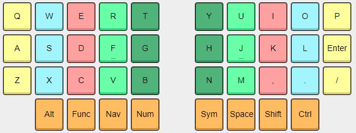
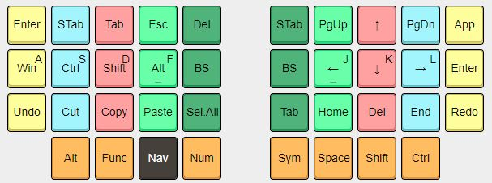
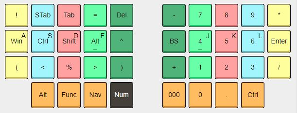
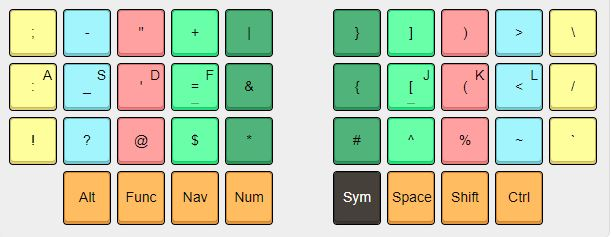
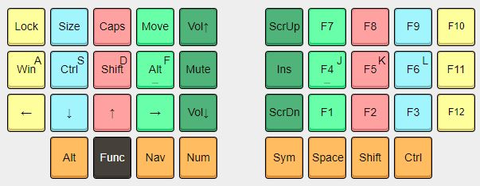

# mull.in-Keymap

I really like the mull.in keymap and flash it on any keyboard I am using, so here is a repo with a keymap for some keyboards in QMK.

Here are images from mull.in on what his keymap is:

## Base Layer

## Navigation Layer

## Number Layer

## Symbol Layer

## Function Layer

